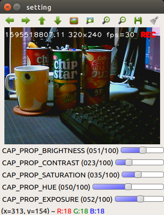

# simple_webcam_tool
simple webcam setting, recording tool



> How to use this tool

```bash
> python3 webcam_tool.py
```

|keybord shortcut|function|
|-|-|
|q|quit tool|
|w|output current camera parameters|
|r|view recording (toggle on/off)|

> Change Camera Id, FPS, Width and Height, Setting

Editing this source.

```python
DEVICE_ID = 0
FPS=30
WIDTH=320
HEIGHT=240
PATH = 'camera.setting'
```

Select VideoCapture API backends identifier.

https://docs.opencv.org/3.4/d4/d15/group__videoio__flags__base.html#ga023786be1ee68a9105bf2e48c700294d

Edit a following code.

```python
# for pc
#cap = cv2.VideoCapture(DEVICE_ID)
# for jetson
cap = cv2.VideoCapture(DEVICE_ID, cv2.CAP_V4L2)
```

> Memo : Get webcam informations

```bash
> sudo apt-get install v4l-utils

> v4l2-ctl --list-devices

SPMT6A9F01 (usb-70090000.xusb-2.1):
        /dev/video0

> v4l2-ctl -d /dev/video0 --all

Driver Info (not using libv4l2):
        Driver name   : uvcvideo
        Card type     : SPMT6A9F01
        Bus info      : usb-70090000.xusb-2.1
        Driver version: 4.9.140
        Capabilities  : 0x84200001
                Video Capture
:

> v4l2-ctl -d /dev/video0 --list-formats-ext

ioctl: VIDIOC_ENUM_FMT
        Index       : 0
        Type        : Video Capture
        Pixel Format: 'YUYV'
        Name        : YUYV 4:2:2
                Size: Discrete 1280x720
                        Interval: Discrete 0.133s (7.500 fps)
                Size: Discrete 160x120
                        Interval: Discrete 0.033s (30.000 fps)
                Size: Discrete 320x240
                        Interval: Discrete 0.033s (30.000 fps)
                Size: Discrete 352x288
                        Interval: Discrete 0.033s (30.000 fps)
                Size: Discrete 800x600
                        Interval: Discrete 0.067s (15.000 fps)
                Size: Discrete 640x480
                        Interval: Discrete 0.033s (30.000 fps)
                Size: Discrete 1280x720
                        Interval: Discrete 0.133s (7.500 fps)

        Index       : 1
        Type        : Video Capture
        Pixel Format: 'MJPG' (compressed)
        Name        : Motion-JPEG
                Size: Discrete 1280x720
                        Interval: Discrete 0.033s (30.000 fps)
                Size: Discrete 160x120
                        Interval: Discrete 0.033s (30.000 fps)
                Size: Discrete 320x240
                        Interval: Discrete 0.033s (30.000 fps)
                Size: Discrete 352x288
                        Interval: Discrete 0.033s (30.000 fps)
                Size: Discrete 800x600
                        Interval: Discrete 0.033s (30.000 fps)
                Size: Discrete 640x480
                        Interval: Discrete 0.033s (30.000 fps)
                Size: Discrete 1280x720
                        Interval: Discrete 0.033s (30.000 fps)

```

